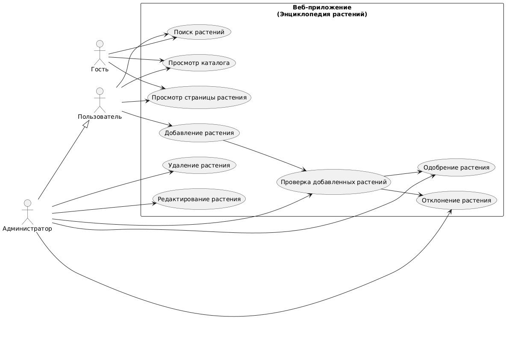
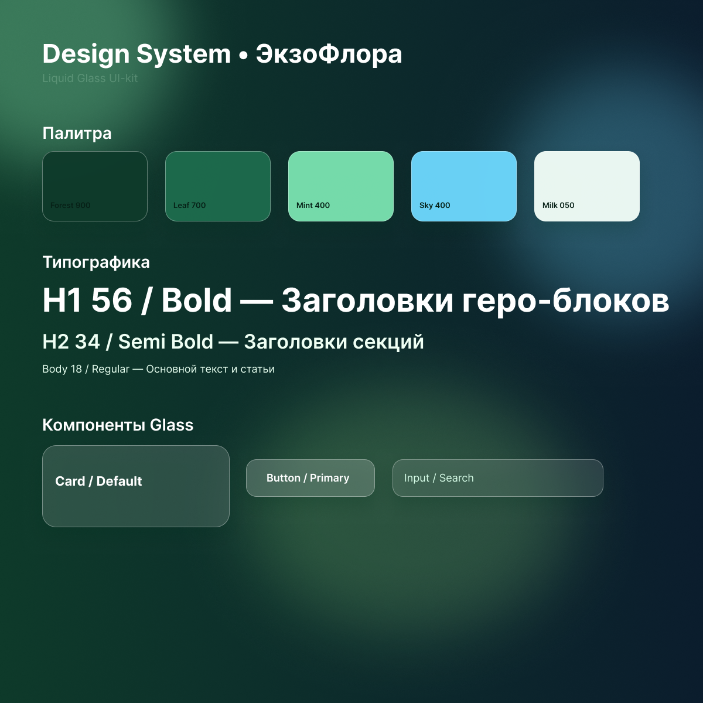
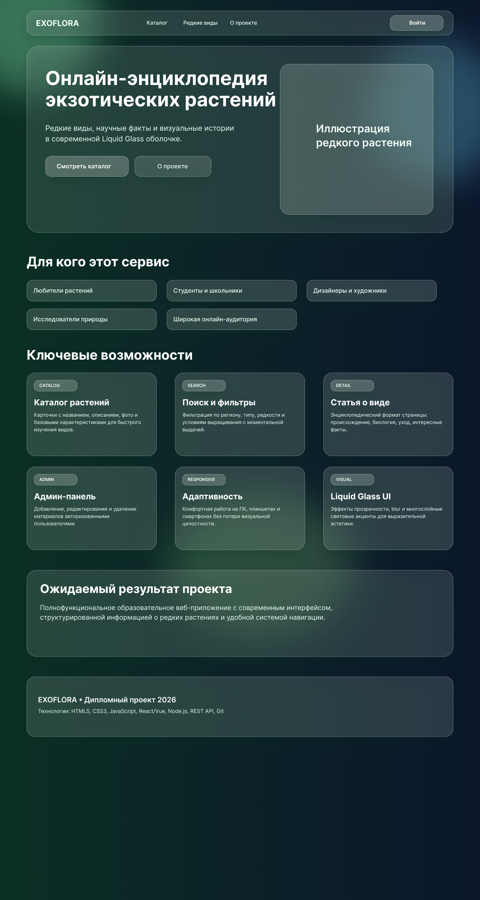
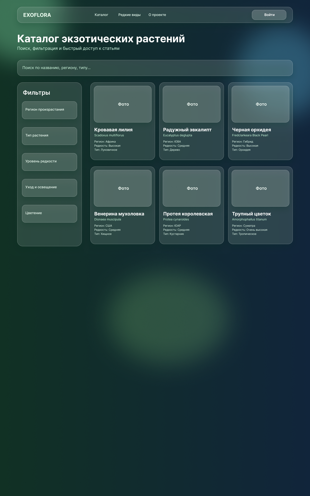
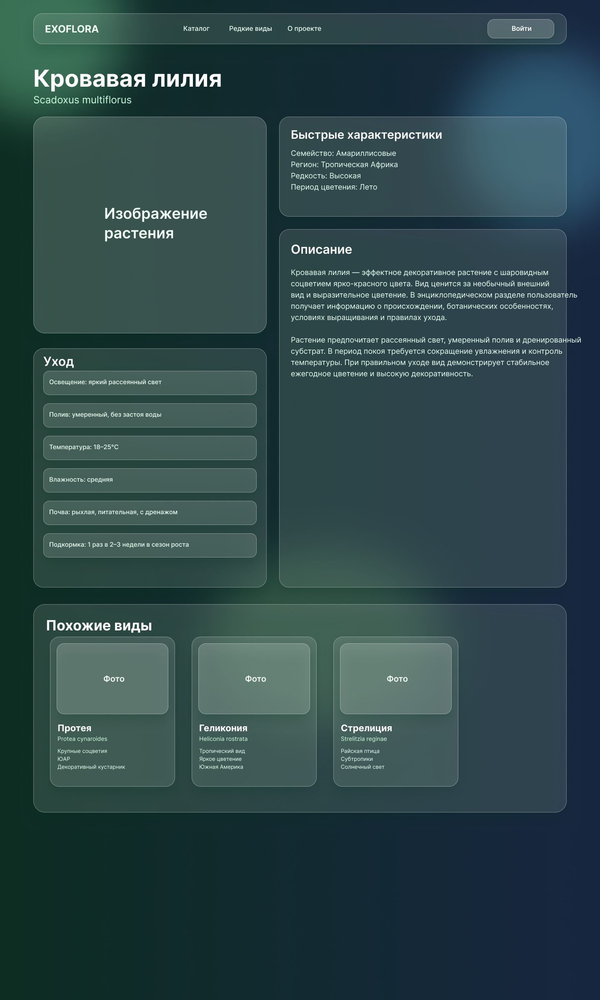
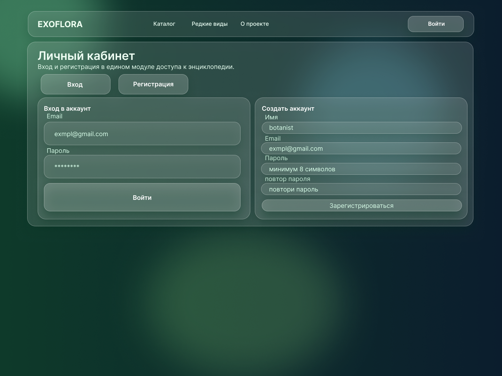
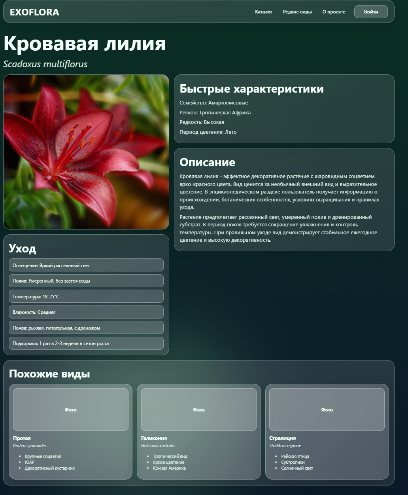
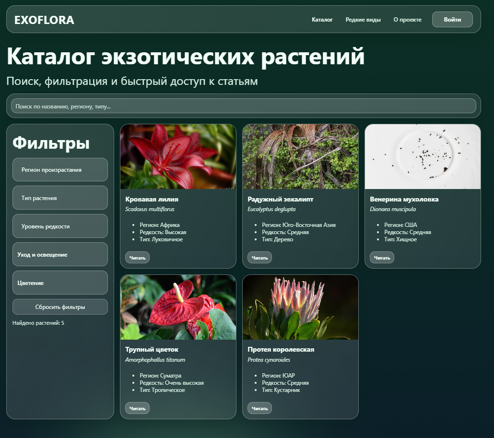
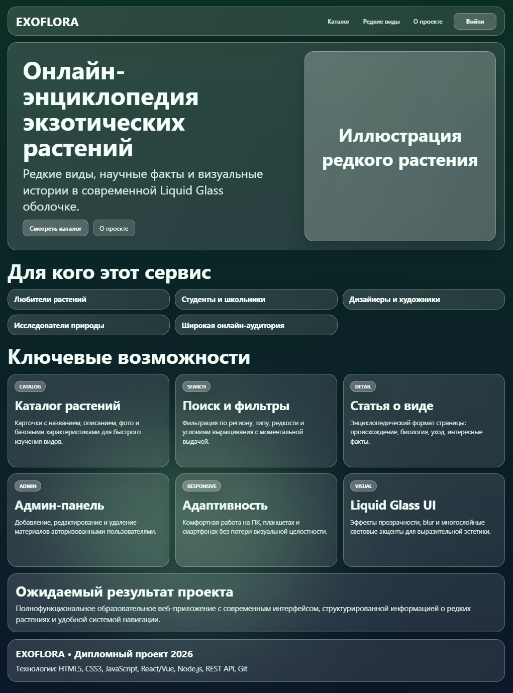
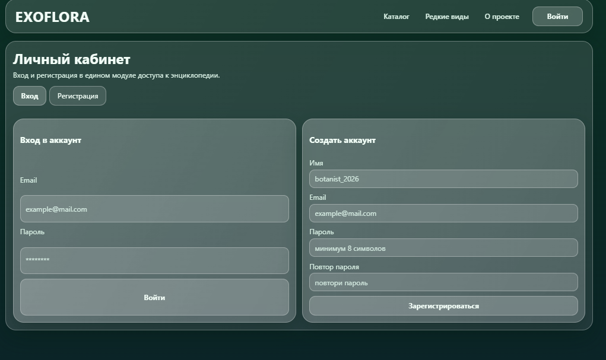

# EXOFLORA — веб-энциклопедия экзотических растений

## Описание проекта
EXOFLORA — дипломный проект: веб-приложение-энциклопедия экзотических растений с современным Liquid Glass интерфейсом.
Пользователь может изучать каталог редких видов, открывать подробные карточки растений, использовать поиск и фильтры, а также работать с модулем авторизации.

## Актуальность темы
В современной цифровой среде пользователи ожидают не только доступ к информации, но и удобный визуальный опыт.
Существующие ресурсы о редких растениях часто перегружены текстом и имеют устаревший интерфейс, поэтому проект EXOFLORA решает задачу создания понятной, эстетичной и удобной онлайн-энциклопедии.

## Целевая аудитория
- Любители растений и цветоводы, интересующиеся редкими видами
- Студенты и школьники, изучающие биологию и ботанику
- Дизайнеры и креативные специалисты, ищущие визуальное вдохновение
- Пользователи, интересующиеся природой и образовательным контентом
- Широкая интернет-аудитория

## Функции и возможности
- Каталог экзотических растений с карточками (название, описание, характеристики)
- Поиск и фильтрация по параметрам (регион, тип, редкость и др.)
- Страница детального описания каждого растения
- Модуль авторизации и регистрации
- Базовая клиентская логика: обработка форм и валидация данных
- Адаптивный интерфейс для desktop/tablet/mobile
- Визуальные эффекты Liquid Glass / glassmorphism

## Используемые технологии
- HTML5
- CSS3
- JavaScript (ES6+)
- React + Vite (frontend)
- Node.js + Express (backend API)
- REST API
- Git

## Ожидаемый результат
Полнофункциональное образовательное веб-приложение с современным интерфейсом, структурированной информацией о редких растениях и удобной навигацией.
Проект готов к дальнейшему расширению: углубленной авторизации, модерации контента и подключению базы данных.

## Use-case диаграмма


## Дизайн-система (Figma)


## Макеты экранов (Figma)
### 1. Главная страница


### 2. Каталог растений


### 3. Страница растения


### 4. Авторизация и регистрация


## Запуск проекта
### Быстрый запуск (Windows / PowerShell)
```powershell
./start.ps1
```

Остановка:
```powershell
./stop.ps1
```

### Ручной запуск
Backend:
```bash
cd exoflowers-server
npm install
npm run dev
```

Frontend:
```bash
cd exoflowers-client
npm install
npm run dev
```

## Скриншоты рабочего сайта (браузер)
### 1. Страница растения (живой скриншот)


### 2. Каталог (живой скриншот)


### 3. Главная страница (живой скриншот)


### 4. Авторизация и регистрация (живой скриншот)

